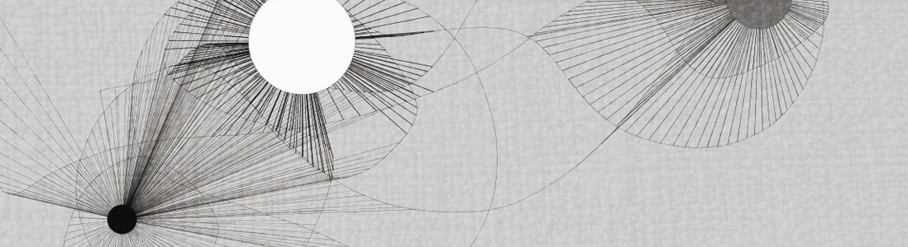
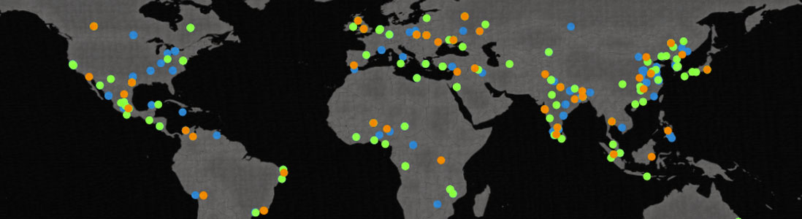

# 6310
6310 Course at Georgia Tech

Note that basically none of these projects work any more as-is - if you want to run them, you might have to jump
through a few hoops to get Processing to play nicely. Specifically, these examples won't run on the
newest version of processing.

You can see previews of the projects below:

Each of these projects was completed using Processing (a Java drawing tool) as part of assigned work in 6310, Computation as an Expressive Medium.
